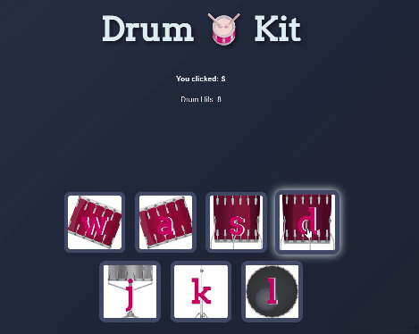

# 🥁 Drum Kit Web App

An **interactive Drum Kit web application** built using **HTML, CSS, and JavaScript**.  
Users can play drum sounds using **keyboard keys or mouse clicks**, making the experience fun and engaging.

This project demonstrates **JavaScript DOM manipulation, event handling, animations, and audio playback**.

---

## 🚀 Live Demo

https://kaushikshivam-stack.github.io/drum-kit-javascript/

---

## ✨ Features

- 🥁 Play drum sounds using **keyboard keys (W A S D J K L)**
- 🖱️ Click drum buttons to play sounds
- 🔊 Realistic drum sound effects
- 📊 **Drum Hit Counter**
- 🎨 Button animation and hover effects
- ⌨️ Displays **last key pressed**
- 📱 Responsive design for mobile screens

---

## 🛠️ Tech Stack

- **HTML5**
- **CSS3**
- **JavaScript (DOM Manipulation)**

---

## 🎮 Controls

| Key | Drum |
|----|----|
| W | Tom 1 |
| A | Tom 2 |
| S | Tom 3 |
| D | Tom 4 |
| J | Snare |
| K | Crash |
| L | Kick |

You can also **click the drum buttons** with your mouse.

---

## ⚡ How to Run the Project

1. Clone the repository

```
git clone https://github.com/kaushikshivam-stack/drum-kit.git
```

2. Open the project folder

3. Open **index.html** in your browser

---

## 💡 What I Learned

While building this project, I practiced:

- JavaScript **event listeners**
- **Keyboard and mouse interaction**
- **DOM manipulation**
- Playing **audio using JavaScript**
- Creating **interactive UI with CSS animations**

---

## 🎥 Demo



---

## 👨‍💻 Author

**Shivam K@ushik**

GitHub:  
https://github.com/kaushikshivam-stack

LinkedIn:  
www.linkedin.com/in/shivam-kaushik-2980023b2

---

⭐ If you like this project, consider giving it a **star on GitHub**!
